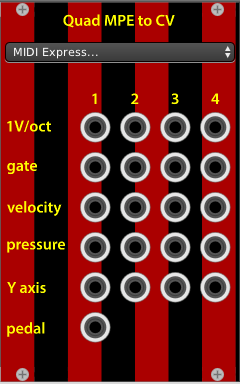
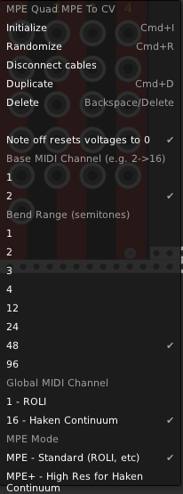

# MPE to CV modules

These are VCVRack modules designed for using "Multidimensional Polyphonic Expression" (MPE) controllers such as the Haken Continuum, Linnstrument, Madrona Labs Soundplane and Roli devices with VCV Rack.

We currently have a monophonic and Quad MPE to CV modules with several outputs and configuration options designed to adapt to different MPE controllers

## New Quad module

I have just added a new Quad module. It is a bit more robust than the previous monophonic and now retains the settings between sessions (will fix that on the mono).

## 1. Installation 

You can find the latest release here: https://github.com/bafonso/MPE/releases
Just download for you architecture and unzip in your _**Rack**_ folder located in your documents.

## 2. Outputs and details
1V/oct : Note you play combined with 14bit pitchwheel information. Adjust the pitch bend range (in semitones) to match your controller. Note that you can "slide" over 96 semitones using the current standard!

Gate: Note On/Off 

Velocity: 0-10V representation of Midi Note On velocity. (Could potentially implement Note Off velocity from Roli in the future)

Pressure: 0-10V representation of pressure or channel aftertouch. 

Y axis: 0-10V representation of CC 74 (7 bit resolution) on the selected channel. 

Pedal: 0-10V representation of CC 12 on global channel (1 or 16). 

# MPE and MPE+
The Haken Continuum supports 14bit MPE for both pressure and Y control by using two 7bit CC (MSB and LSB). Let me know if you other controllers have this and we need to support different combinations of CC #s.

See also http://www.rogerlinndesign.com/mpe.html 

